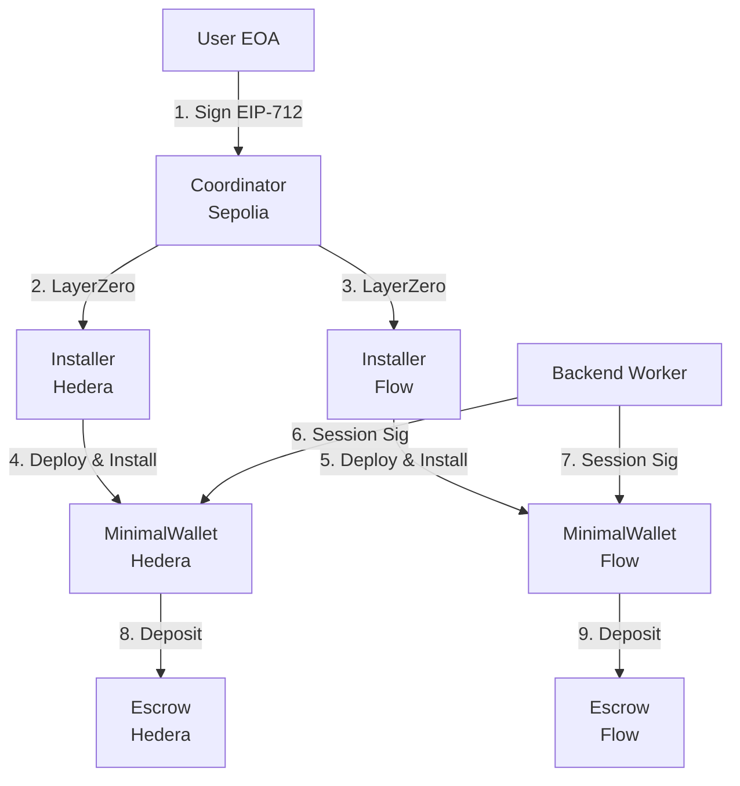

# Cross-Chain Session Key Management System

A production-ready implementation of cross-chain session key management using LayerZero V2 OApp messaging. Enables **one-click UX** where users sign a single MetaMask transaction on Sepolia to install session keys across multiple EVM testnets.

## 🎯 Key Features

- **One-Click UX**: Single MetaMask signature installs sessions on 3 chains
- **LayerZero V2 OApp**: Uses generic messaging (not OFT) for session installation
- **EIP-712 Signatures**: Secure session intent signing with typed data
- **Policy Enforcement**: Per-token limits, escrow allowlist, time expiry
- **Deterministic Wallets**: CREATE2 smart accounts with session modules
- **Multi-Chain Support**: Sepolia, Hedera EVM, Flow EVM testnets

## 🏗 Architecture



## 📦 Contract Overview

### Core Contracts

| Contract | Description | Deployment |
|----------|-------------|------------|
| `Coordinator.sol` | Session installation orchestrator | Sepolia only |
| `Installer.sol` | Cross-chain session receiver | Hedera, Flow |
| `MinimalWallet.sol` | Smart account with session support | All chains |
| `SessionModule.sol` | Session key policy enforcement | All chains |
| `WalletFactory.sol` | Deterministic wallet deployment | All chains |
| `Escrow.sol` | Token/native deposit recipient | All chains |

### Key Components

- **EIP-712 SessionIntent**: Structured session installation data
- **CREATE2 Wallets**: Deterministic addresses across chains
- **Policy Framework**: Token limits, escrow allowlist, time expiry
- **LayerZero Messaging**: Reliable cross-chain communication

## 🚀 Quick Start

### 1. Setup Environment

```bash
cd /Users/derekliew/Developer/ethindia/zero/my-lz-oapp
npm install
cp .env.example .env
# Fill in your private keys and RPC URLs
```

### 2. Deploy Contracts

```bash
# Deploy on all chains
npx hardhat lz:deploy --network sepolia
npx hardhat lz:deploy --network hedera-testnet  
npx hardhat lz:deploy --network flow-testnet

# Wire LayerZero connections
npx hardhat lz:oapp:wire --oapp-config layerzero.config.ts
```

### 3. Use Frontend

```bash
cd /Users/derekliew/Developer/ethindia
npm run dev
# Visit http://localhost:3000/session
```

### 4. Backend Execution

```bash
# Execute session deposits
npx hardhat lz:session:execute \
  --network hedera-testnet \
  --user-address 0x... \
  --escrow-address 0x... \
  --token-address 0x0 \
  --amount 1000000000000000000
```

## 🧪 Testing

```bash
# Run comprehensive test suite
npx hardhat test

# Run specific session management tests
npx hardhat test test/hardhat/SessionManagement.test.ts

# Test cross-chain messaging
npx hardhat lz:oapp:send --network sepolia --dst-eid 40230 --string "test"
```

## 📋 Token Support

| Chain | Native | ERC-20 Tokens |
|-------|--------|---------------|
| **Sepolia** | ETH | PYUSD, LINK |
| **Hedera** | HBAR | USDC |
| **Flow** | FLOW | - |

## 🔐 Security Features

### Session Policies
- **Token Limits**: Per-token spending caps (e.g., 1000 PYUSD, 10 HBAR)
- **Escrow Allowlist**: Only approved escrow contracts can receive funds
- **Time Expiry**: Sessions automatically expire (default: 24 hours)
- **Revocation**: Users can revoke active sessions at any time

### Access Control
- **Peer Verification**: Only trusted LayerZero peers can send messages
- **Signature Verification**: ECDSA signature required for all session operations
- **Owner Controls**: Only wallet owners can install/revoke sessions

## 🔧 Configuration

### LayerZero Endpoint IDs

| Network | Chain ID | Endpoint ID | Status |
|---------|----------|-------------|---------|
| Sepolia | 11155111 | 40161 | ✅ Confirmed |
| Hedera Testnet | 296 | 40230 | ⚠️ TODO: Verify |
| Flow Testnet | 545 | 40231 | ⚠️ TODO: Verify |

### Contract Addresses

Update these after deployment:

```javascript
// pages/session.js
const SEPOLIA_COORDINATOR_ADDRESS = "0x..." // TODO
const SEPOLIA_WALLET_FACTORY_ADDRESS = "0x..." // TODO

const ESCROW_ADDRESSES = {
  sepolia: "0x...", // TODO
  hedera: "0x...", // TODO  
  flow: "0x..." // TODO
}
```

## 📖 Documentation

- **[RUNBOOK.md](./RUNBOOK.md)**: Complete deployment and operation guide
- **[Architecture](#architecture)**: System design and data flow
- **[API Reference](#contract-overview)**: Contract interfaces and methods
- **[Security](#security-features)**: Security model and considerations

## 🎛 Commands Reference

### Deployment
```bash
npx hardhat lz:deploy --network <network> --tags <contract>
npx hardhat lz:oapp:wire --oapp-config layerzero.config.ts
```

### Session Management
```bash
npx hardhat lz:session:install --network sepolia --session-pub-key 0x...
npx hardhat lz:session:execute --network <network> --user-address 0x...
```

### Monitoring
```bash
npx hardhat lz:oapp:peers --network <network>
npx hardhat lz:oapp:send --network <network> --dst-eid <eid> --string "test"
```

## 🐛 Troubleshooting

### Common Issues

| Error | Solution |
|-------|----------|
| "Insufficient fee" | Re-quote LayerZero fees, prices fluctuate |
| "Invalid signature" | Verify session private key matches public key |
| "SessionExpired" | Install new session, default expiry is 24 hours |
| "EscrowNotAllowed" | Check escrow address in session allowlist |

### Debug Resources

- **LayerZero Scan**: https://testnet.layerzeroscan.com
- **Block Explorers**: Sepolia, Hedera, Flow testnet explorers
- **Contract Verification**: Use `npx hardhat verify`

## 🤝 Contributing

1. Fork the repository
2. Create a feature branch
3. Run tests: `npx hardhat test`
4. Submit a pull request

## 📄 License

This project is licensed under the UNLICENSED License - see the contract headers for details.

## 🔗 Links

- **LayerZero V2 Docs**: https://docs.layerzero.network/v2
- **OApp Standard**: https://docs.layerzero.network/v2/developers/evm/oapp
- **Discord Support**: https://discord.gg/layerzero

---

**Built with ❤️ using LayerZero V2 for ETHIndia 2025**